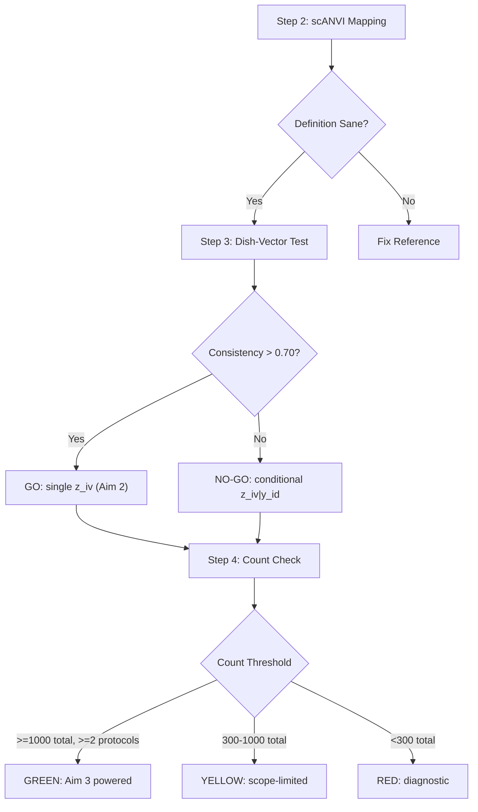

# NullState

**Convergent or Lineage-Specific? The Geometry of Off-Target Cell States Across Human Organoid Systems**

[](LICENSE)

NullState is a computational-biology project that asks whether the *off-target* cell
populations produced when human organoid differentiation fails **converge** across germ
layers toward shared "default" states, or fail in **lineage-specific** ways.

> ### Two research strands
> This repository holds two related but separable bodies of work.
>
> **1. The biology (this README).** The organoid off-target question, the HNOCA
> compute pilot, and the manuscript in [`docs/manuscript/`](docs/manuscript/).
>
> **2. Identifiability and evaluation methodology**
> ([`identifiability/`](identifiability/README.md)). Attempting Aim 2 raised a question the
> biology could not settle: *what can a latent-recovery metric actually detect?*
> That became a self-contained, synthetic, CPU-only study with its own paper in
> [`docs/tmlr/`](docs/tmlr/) — the finding being that every recovery estimand has
> an invariance class, and a result is an artifact whenever the failure mode under
> test lies inside it. It needs no data download and is the fastest thing here to
> verify: three commands, about five minutes. Start at
> [`identifiability/REPRODUCE.md`](identifiability/REPRODUCE.md).
>
> The two strands share a repository because the second grew out of the first, and
> because the first strand's early analysis is the worked example the second
> corrects. Retired work is kept, labelled, and explained rather than deleted.

## Central Hypothesis
Off-target states form a **structured mixture**: a subset converging across germ layers
toward shared default states, and a subset that is lineage-bound.

## Specific Aims
1. **Construct a harmonized cross-germ-layer reference space and off-target ontology.**
2. **Disentangle the *in-vitro* stress signature from lineage biology** by contrastive subspace separation.
3. **Characterize and validate the geometry of off-target convergence.**

## The HNOCA Pilot
Before executing the full three-aim project, this repository implements a compute pilot on the
Human Neural Organoid Cell Atlas (HNOCA) to resolve three empirical go/no-go gates:



### Pilot outcome (all gates passed)
| Gate | Result | Detail |
|------|--------|--------|
| A — Definition sane | **PASS** | coherent on-target neural core; `other` ≈ 0 |
| B — Dish-Vector | **GO** | mean cosine 0.906 (> 0.70) ⇒ single shared `z_iv` |
| C — Count Check | **GREEN** | 7,568 off-target mesenchymal cells; 4 protocols ≥ 300 |

Cross-atlas harmonization independently verified (batch iLISI 8.04 vs. 5.94 unintegrated,
cell-type structure preserved). Full write-up, figures, and honest limitations:
**[`reports/nullstate_pilot_report.pdf`](reports/nullstate_pilot_report.pdf)**.

## Installation
```bash
# Conda (recommended)
conda env create -f env/environment.yml
conda activate nullstate

# or pip
python3 -m venv venv && source venv/bin/activate
pip install -r requirements.txt
```

## Usage
```bash
# 1. Obtain the atlases (see data/README.md), then build the reference
python scripts/run_pilot.py --skip-to-step 1

# 2. Pre-flight data checks before a long run
python scripts/preflight_check.py --config-dir config/

# 3. Run the pilot from the mapping step
python scripts/run_pilot.py --skip-to-step 2 --config-dir config/
```

## Repository Structure
```
NullState/
├── config/            YAML config (paths, params, gene sets)
├── data/              Atlases (gitignored; see data/README.md)
├── docs/              Research strategy, aims, execution plan
│   ├── manuscript/    Biology manuscript (LaTeX, figures, supplement)
│   └── tmlr/          Identifiability paper (anonymized submission build)
├── env/               Conda environment definition
├── models/            Trained scVI/scANVI weights (gitignored)
├── reports/           Pilot report (PDF + LaTeX), figures, run artifacts
├── scripts/           Pipeline & data-retrieval scripts
├── identifiability/        Identifiability & metric-invariance study (synthetic, standalone)
├── src/               Core package
│   ├── data/          Reference construction, retrieval, schema discovery
│   ├── mapping/       scVI/scANVI training, scoring, classification
│   ├── calibration/   Dish-vector test
│   ├── gates/         Count-check gate
│   └── utils/         Origin map, QC, logging, config
└── tests/             Unit tests
```

## Data Sources
- He, Fleck et al. "An integrated transcriptomic cell atlas of human neural organoids." *Nature* 2024.
- Braun et al. "Comprehensive cell atlas of the first-trimester developing human brain." *Science* 2023.
- Cao et al. "A human cell atlas of fetal gene expression." *Science* 2020.

See [`data/README.md`](data/README.md) for download instructions.

## Outputs

| output | where |
|---|---|
| Pilot report (gates, figures, limitations) | [`reports/nullstate_pilot_report.pdf`](reports/nullstate_pilot_report.pdf) |
| Biology manuscript | [`docs/manuscript/`](docs/manuscript/) |
| Identifiability paper (anonymized build) | [`docs/tmlr/`](docs/tmlr/) |
| Identifiability code, results and reproduction guide | [`identifiability/`](identifiability/README.md) |

## Reproducibility

The `identifiability/` study is fully reproducible from this repository: it is
synthetic, CPU-only, and every headline result table is committed, so each
analysis and figure regenerates in seconds without repeating the sweeps that
produced it. Its pipeline is **gated** — three verification scripts print
per-check PASS/FAIL and exit non-zero on failure, and no downstream stage was run
until the stage below it passed. See
[`identifiability/REPRODUCE.md`](identifiability/REPRODUCE.md) for a claim-to-script map.

The biology pipeline requires the source atlases; see
[`data/README.md`](data/README.md) for download instructions.

## License
Released under the [MIT License](LICENSE).
